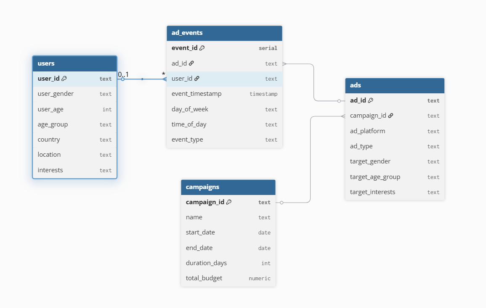

# OnTarget – Social Media Ad Analytics

##  Company Overview
**OnTarget** is a social media analytics project that helps brands run smarter ad campaigns.  
We analyze **user engagement, demographics, and campaign performance** to provide insights that improve ad targeting and return on investment (ROI).

---

##  Project Description
This project simulates the work of a **data analyst for social media advertising**.  
It includes:
- A relational database with multiple tables (users, posts, ads, campaigns, engagement).  
- SQL queries to explore ad performance, user behavior, and campaign efficiency.  
- A Python script to connect to the database and fetch insights.  
- Visualization setup (using Apache Superset) for dashboards and reporting.  

---
## Screenshot 



##  Setup Instructions

### 1. Clone the repository
```bash
git clone https://github.com/raibaebe/OnTarget-Ad-Analytics.git
cd Ontarget-Ad-Analytics
```
### 2. Run python script
```bash
python scripts/main.py


